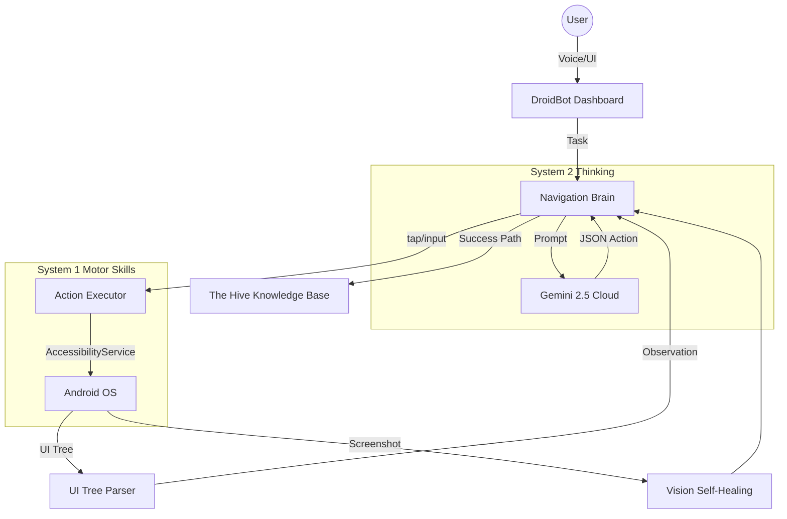

# 🤖 DroidBot: The Universal Autonomous Android Agent

[](https://developer.android.com)
[](https://ai.google.dev/)
[]()

**DroidBot** is an advanced, autonomous AI agent designed to navigate the Android operating system with human-like reasoning. Unlike traditional automation tools that rely on rigid scripts, DroidBot uses a **ReAct (Reasoning + Action)** loop powered by **Gemini 2.5 Flash** to "see," "think," and "act" dynamically within any application.

---

## 📽️ The Vision
Our goal is to build the first truly universal Android agent. Whether it's booking a flight through a complex travel app, comparing prices across e-commerce platforms, or automating multi-app workflows, DroidBot handles the complexity so you don't have to.

### Core Philosophy
- **Dynamic Reasoning**: No hardcoded paths. The agent analyzes the UI in real-time.
- **Privacy First**: Sensitive actions (payments, credentials) are protected by a **Biometric Gate**.
- **Self-Healing**: If the UI tree is unreadable, DroidBot uses computer vision to "peek" at the screen and find its way.

---

## 🧠 Key Features

### 1. The ReAct Brain
Implements a sophisticated **Reasoning + Action** loop:
- **Observe**: Parses the Android Accessibility Tree into a numbered text representation.
- **Think**: Consults **Gemini 2.5 Flash** to determine the next logical step toward the goal.
- **Act**: Executes precise taps, scrolls, and text inputs.
- **Reflect**: Monitors UI changes to verify success or pivot if a blocker (like a login wall) is hit.

### 2. Gemini 2.5 Hybrid Engine
- **Primary**: Uses `gemini-2.5-flash` for high-speed, long-context reasoning.
- **Fallback**: Automatically switches to `gemini-2.5-flash-lite` if the primary model hits rate limits or fails, ensuring zero downtime.

### 3. "Hey DroidBot" Voice Orchestration
Built-in background service that listens for the wake word.
- **Continuous Listening**: Foreground service with microphone access.
- **Zero-Touch Execution**: Just say "Hey DroidBot, find me the cheapest flight to Tokyo in May," and the agent starts work immediately.

### 4. Vision Self-Healing
When apps use custom canvases or anti-accessibility patterns, DroidBot switches to its **Vision System**:
- Takes a screenshot.
- Uses Gemini Vision to identify the (x, y) coordinates of elements.
- Performs coordinate-based taps to bypass navigation blockers.

### 5. The Hive (Shared Knowledge)
DroidBot learns from successful runs. 
- **UIMaps**: Successful navigation paths are distilled into `UIMaps`.
- **Collaborative Intelligence**: The agent queries "The Hive" to find if it has successfully navigated a similar app before, dramatically speeding up performance.

---

## 🛠️ Architecture



---

## 🚀 Getting Started

### Prerequisites
- Android 9.0 (API 28) or higher.
- A **Gemini API Key** from [Google AI Studio](https://aistudio.google.com/).

### Installation
1. Clone the repository:
   ```bash
   git clone https://github.com/ishitzzz/droid-bot.git
   ```
2. Open in **Android Studio Ladybug** or newer.
3. Create a `local.properties` file in the root directory and add your API key:
   ```properties
   GEMINI_API_KEY=your_api_key_here
   ```
4. Build and deploy to your device.
5. **Enable Accessibility Service**: Navigate to Settings → Accessibility → DroidBot and toggle "On".

---

## 🛡️ Security & Privacy
- **Local Credentials**: Credentials are stored in the `IdentityVault` using **EncryptedSharedPreferences**.
- **Biometric Gate**: Any action involving payments (via Prava) or sensitive data requires a fingerprint or face unlock via the `BiometricGate`.
- **Key Protection**: `local.properties` is strictly ignored by `.gitignore` to prevent API key leaks.

---

## 📜 License
This project is for research and development purposes.

---
*Built with ❤️ for the future of Autonomous Intelligence.*
