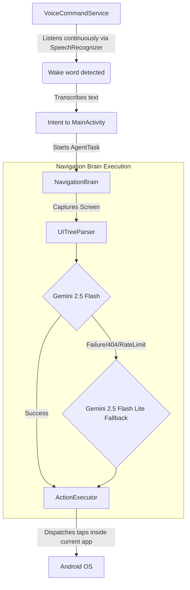

# DroidBot Agent Context Log

This file acts as the universal memory and changelog for DroidBot.
**All AI agents modifying this repository MUST append their changes here in reverse chronological order**, explaining the *what*, the *why*, and showing any architectural/flow changes via Mermaid diagrams.

---

## 📅 Session: Gemini & Voice Integration & Git Deploy
**Agent**: Antigravity  
**Goal**: Integrate voice commands ("Hey DroidBot"), fix agent navigation constraints, and update the Gemini brain.

### 📝 What Was Changed:
1. **Implemented Continuous Voice Recognition**: Replaced simulated wake word with Android's built-in `SpeechRecognizer` in `VoiceCommandService.kt` to allow continuous listening and real transcription.
2. **Fixed In-App Action Stalling**: Removed hardcoded `GLOBAL_ACTION_HOME` from `tryLaunchAppFromTask`. 
3. **Updated Gemini Models**: Switched the `CloudInference.kt` to explicitly use `gemini-2.5-flash` as primary and `gemini-2.5-flash-lite` as fallback.
4. **Git Repository Initialization**: Initialized Git, created `.gitignore`, and pushed.

### 🧠 Why It Was The Best Option:
- **Voice Recognition**: Sending raw intents from background services on newer Android versions requires specific foreground permissions. Using `SpeechRecognizer` continuously allows true hands-free activation.
- **In-App Navigation Constraint**: The user noted the bot was just opening apps, navigating home, and stopping. Agents need context switching, but sometimes a task ("search for X") starts in the *currently* opened app (like Gmail or Chrome). Removing the forced home-screen constraint makes DroidBot modular.
- **Model Fallbacks**: Gemini 2.5 Flash is the fastest model for autonomous parsing, but if rate limits are hit, having an immediate try-catch block to flip to `gemini-2.5-flash-lite` avoids crashing the ReAct loop.

### 🔄 Logic Flow Change:

---

## 📅 Session: Initial Project Scaffold
**Goal**: Create a universal autonomous Android agent from scratch.

### 📝 What Was Changed:
- Created the core packages (`brain`, `hive`, `identity`, `navigation`, `service`, `payment`).
- Wrote `NavigationBrain.kt` to implement the ReAct loop.
- Built `UITreeParser.kt` to convert Android `AccessibilityNodeInfo` into compressed, numbered layout strings for LLMs.
- Implemented `ActionExecutor.kt` to translate LLM output `tap(id)` back to UI interactions.

### 🧠 Why It Was The Best Option:
Instead of relying purely on computer vision (which is slow and expensive for LLMs), we designed the agent to parse the native Android accessibility tree. This turns the entire UI into text, making the Gemini context window incredibly efficient. We built the "Vision Self-Healing Engine" only as a fallback for when accessibility is blocked.
