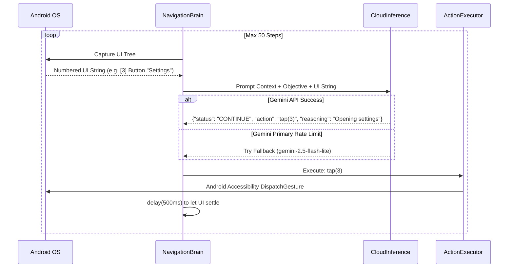
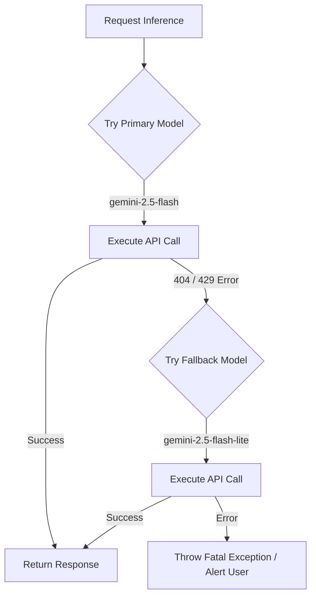

# DroidBot Architecture & Features State

This document contains the *living* architecture of DroidBot. All AI agents must update this file when the infrastructure or logic changes.

---

## 🏗️ Core Architecture (Hybrid Edge-Cloud)

DroidBot uses a **Reasoning + Action (ReAct)** loop powered by Gemini.

```mermaid
graph TD
    User((User Voice/Touch)) -->|Voice Command| Voice[VoiceCommandService]
    Voice --> |Intent| App[MainActivity]
    App -->|Starts Task| Brain[NavigationBrain]
    
    subgraph "The Hand (System 1)"
        Scanner[UITreeParser] -->|Compresses accessibility nodes| Brain
        Brain -->|tap(nodeId), scroll(dir)| Executor[ActionExecutor]
        Executor -->|Performs gesture| OS[Android OS]
    end
    
    subgraph "The Brain (System 2)"
        Brain -->|Prompt + UI State| Cloud[CloudInference]
        Cloud -->|JSON Action| Brain
    end
    
    subgraph "The Eye (Self-Healing Fallback)"
        OS -->|Screenshot| Vision[SelfHealingEngine]
        Vision -->|Image| Cloud
        Cloud -->|x,y Coordinates| Executor
    end
```

---

## ⚙️ Key Algorithms & Logic Workflows

### 1. The ReAct Loop (NavigationBrain)
The core logic driving the agent's autonomy.



### 2. UI Tree Parsing Algorithm
Converting Android's heavyweight `AccessibilityNodeInfo` tree into a lightweight string.

```mermaid
graph TD
    A[Raw AccessibilityNodeInfo] --> B{Is Node Visible to User?}
    B -- No --> C[Discard Node]
    B -- Yes --> D{Is Node Clickable / Editable / Scrollable?}
    D -- No --> E{Does it have text content?}
    E -- No --> C
    E -- Yes --> F[Extract Text]
    D -- Yes --> F
    F --> G[Assign unique incrementing ID]
    G --> H[Format as '[ID] Type: Text']
    H --> I[Append to prompt string]
```

### 3. Voice "Wake Word" Flow
How DroidBot captures commands while in the background.

```mermaid
graph LR
    A[VoiceCommandService] -->|Android SpeechRecognizer| B[Listening...]
    B -->|onResult| C{Contains "Hey DroidBot"?}
    C -- No --> B
    C -- Yes --> D[Extract remaining text]
    D -->|Broadcast/Intent| E[MainActivity]
    E --> F[Trigger NavigationBrain Task]
```

### 4. Gemini Model Fallback Strategy
Ensures the agent doesn't crash if an API endpoint goes dark or the model name is deprecated.



---

## ✨ Up-To-Date Features List

| Feature | State | Implementation File | Describe |
|---------|-------|---------------------|----------|
| **ReAct Loop** | ✅ COMPLETE | `NavigationBrain.kt` | Max 50 steps, parses UI, queries LLM, executes taps. |
| **Voice Engine** | ✅ COMPLETE | `VoiceCommandService.kt` | Continuous Android Speech Recognition in Foreground Service. |
| **Model Tiers** | ✅ COMPLETE | `CloudInference.kt` | STRICTLY uses `gemini-2.5-flash` with a `lite` fallback. |
| **App Neutrality** | ✅ COMPLETE | `MainActivity.kt` | Agent acts on the *currently open app* instead of forcing a redirect to the Home Screen. |
| **UI Parser** | ✅ COMPLETE | `UITreeParser.kt` | Compresses UI by stripping invisible/useless layout wrappers. |
| **IdentityVault** | ✅ COMPLETE | `IdentityVault.kt` | Saves app-specific mock credentials encrypted on disk. |
| **Biometric Gate** | ✅ COMPLETE | `BiometricGate.kt` | Requires Android biometric handshake before returning sensitive data. |

---

> **Agent Note:** If you add a new feature (e.g., SQLite caching for The Hive, or Play Store installation workflows), you must add its architectural flowchart to this document!
