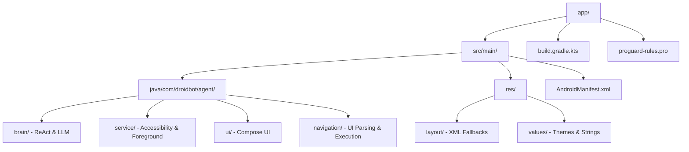
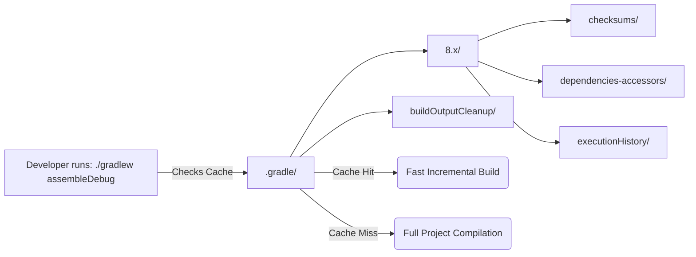
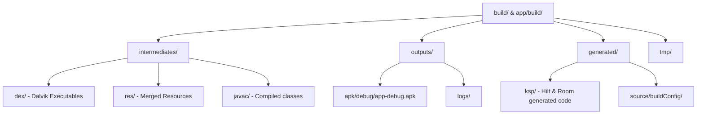
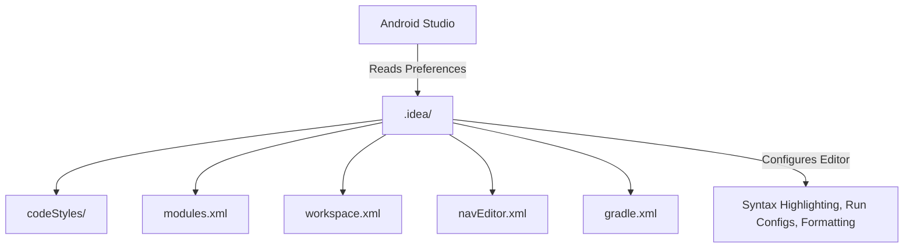

# DroidBot Project Structure & Folder Architecture

This document breaks down the major directories of the DroidBot repository, explaining their function, contents, and how they interact in the Gradle/Android ecosystem.

---

## 1. 📱 `app/` (Application Module)
The `app` directory contains the actual source code, resources, and build configurations for DroidBot. This is the heart of the project.

### Purpose
- **`/src/main/java`**: Contains all Kotlin source code divided by feature packages (Brain, Navigation, Hive, Identity).
- **`/src/main/res`**: Contains Android resources, including vector icons, strings, and the Accessibility Service configuration XML.
- **`build.gradle.kts`**: The module-specific build script that manages dependencies (Compose, Gemini SDK, Hilt) and compiles the APK.

---

## 2. 🐘 `.gradle/` (Gradle Configuration Cache)
A hidden, auto-generated directory managed by the Gradle Build Tool. It stores configurations to speed up subsequent builds.

### Purpose
- **Performance**: Skips re-compiling tasks that haven't changed by saving hashes of source files.
- **Exclusion**: This directory is massive and machine-specific, which is why it is explicitly excluded in `.gitignore`.

---

## 3. 🏗️ `build/` and `app/build/` (Build Artifacts)
These directories contain the compiled outputs of the Gradle build process.

### Purpose
- **`/outputs/apk/`**: Contains the final, installable `.apk` file that goes to the device or Play Store.
- **`/intermediates/`**: The "scratch pad" for the compiler. Raw Kotlin is turned into Java Bytecode, then into DEX files here.
- **`/generated/`**: Holds code that was auto-written by plugins like KSP (Kotlin Symbol Processing) for Hilt Dependency Injection. 

---

## 4. 🧠 `.idea/` (Android Studio IDE Settings)
A hidden directory created by IntelliJ/Android Studio to save your personal workspace settings.

### Purpose
- **`workspace.xml`**: Remembers which files you left open and where your cursors were.
- **`gradle.xml`**: Tells Android Studio where your local Gradle installation lives and how to sync the project.
- **Exclusion**: Like `.gradle/`, this folder contains local paths and user-specific view models. We exclude `workspace.xml`, `tasks.xml`, and caches via `.gitignore` so developers don't overwrite each other's UI preferences on Git.
